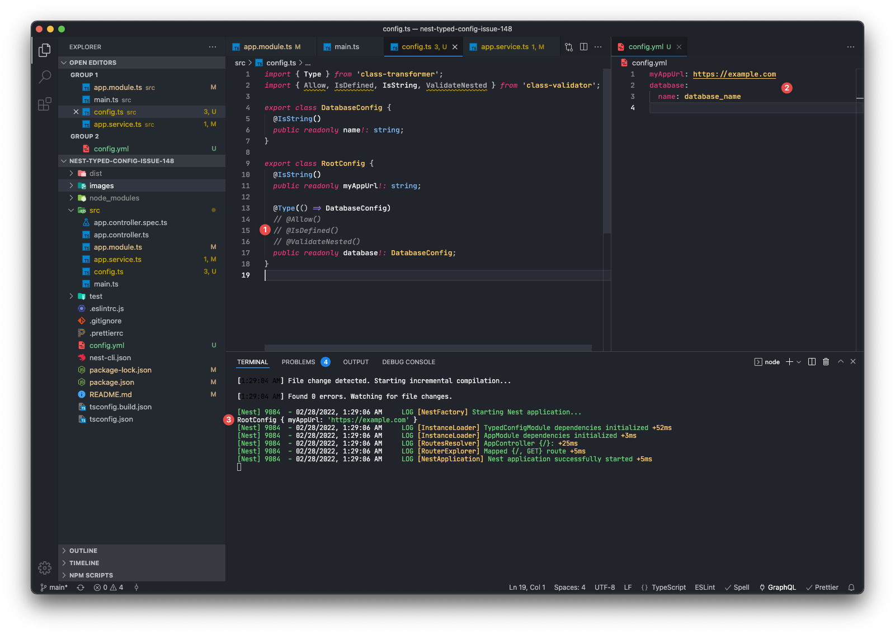
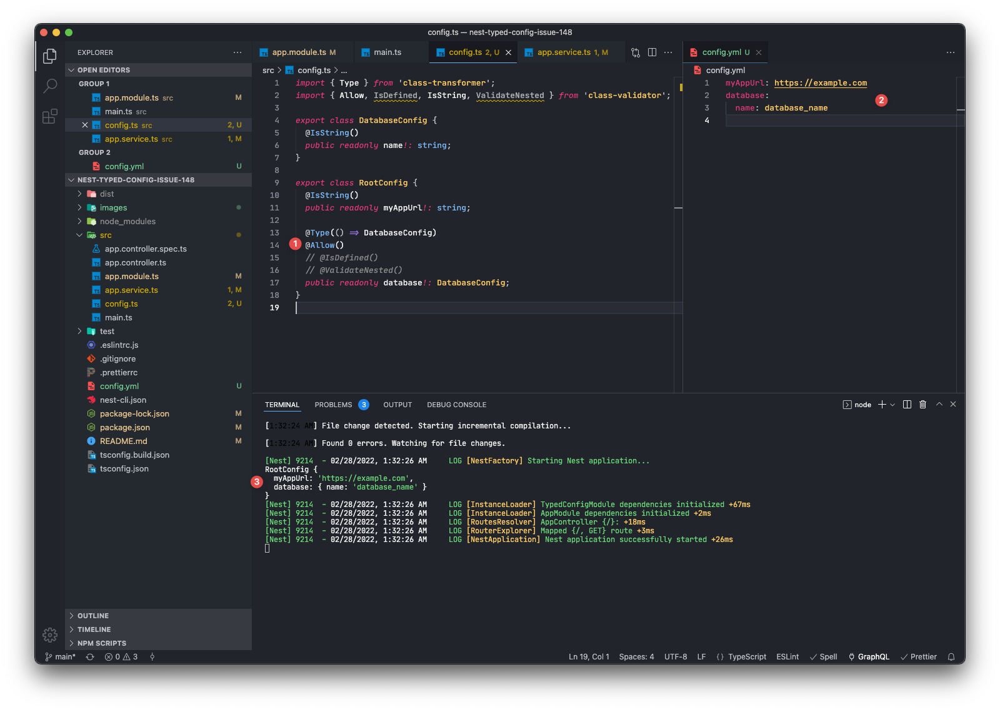
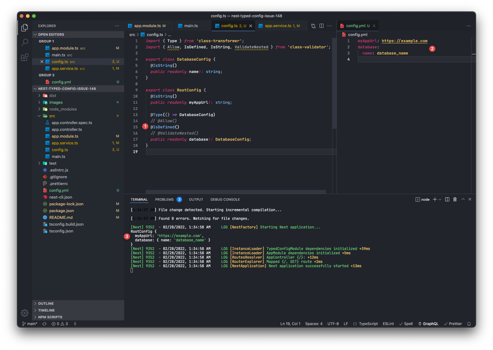
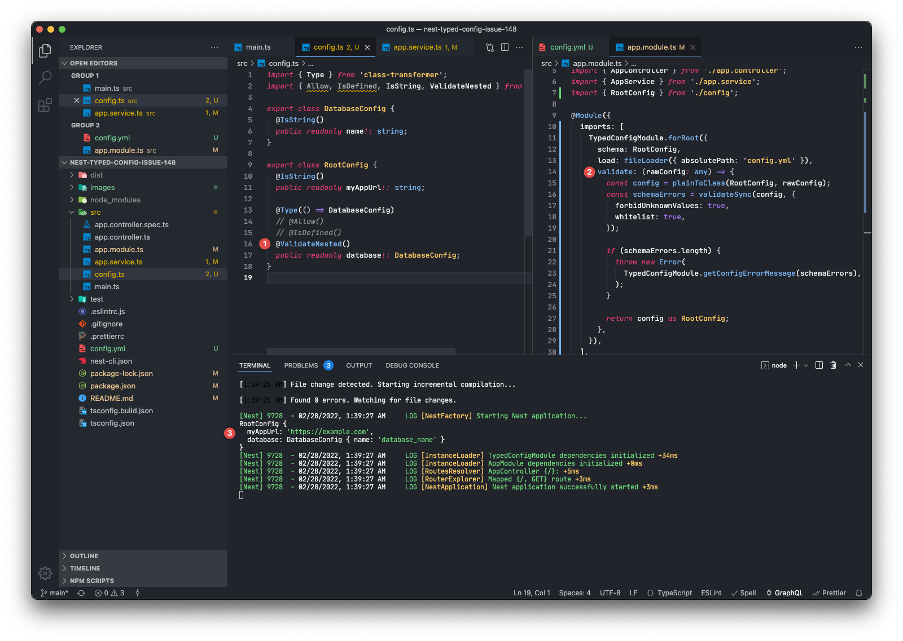

# Nest-Typed-Config Issue 149

Example project for https://github.com/Nikaple/nest-typed-config/issues/149.

```console
$ git clone git@github.com:imkh/nest-typed-config-issue-149.git
$ cd nest-typed-config-issue-149
$ npm install
$ npm run start:dev # see image 4 for full error output

Error: Configuration is not valid:
  - config database.undefined does not match the following rules:
    - unknownValue: an unknown value was passed to the validate function, current config is `undefined`

...
```

`@ValidateNested()` decorator on nested config class doesn't work without custom valid function.

### 1. No decorator WITHOUT custom validate function

❌ Config loads partially: the nested config is missing.



### 2. `@Allow()` decorator WITHOUT custom validate function

❌ Config loads entirely but the nested config is not validated + the nested config can't be injected `AppService`:

```
Nest can't resolve dependencies of the AppService
(RootConfig, ?). Please make sure that the argument
DatabaseConfig at index [1] is available in the AppModule
context.
```



### 3. `@IsDefined()` decorator WITHOUT custom validate function

❌ Config loads entirely but the nested config is not validated + the nested config can't be injected `AppService`:

```
Nest can't resolve dependencies of the AppService
(RootConfig, ?). Please make sure that the argument
DatabaseConfig at index [1] is available in the AppModule
context.
```



### 4. `@ValidateNested()` decorator WITHOUT custom validate function

❌ Throw an error.


### 5. `@ValidateNested()` decorator WITH custom validate function

✅ Works, but needs the custom validate function.


